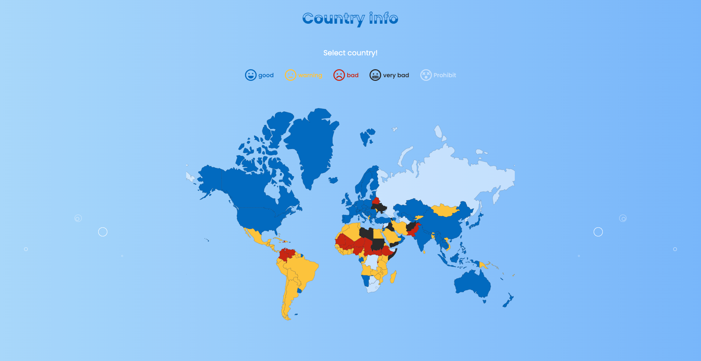

# country-info

> 국가별 정보를 확인할 수 있는 웹 사이트입니다.

지도에서 국가를 선택하여 국가별로 지역, 수도, 언어, 특징 등을 확인할 수 있습니다.

### demo

[https://country-info-phi.vercel.app/](https://country-info-phi.vercel.app/)



## 설치 방법

아래 단계를 따라 프로젝트를 설치하세요.

1. 프로젝트를 클론합니다.

   ```bash
   git clone https://github.com/sorate7624/country-info.git
   ```

2. 프로젝트 디렉토리로 이동합니다.

   ```bash
   cd country-info
   ```

3. 종속성을 설치합니다.

   ```bash
   npm install
   ```

4. 프로젝트를 실행합니다.
   ```bash
   npm run dev
   ```

## 기술 스택

프로젝트의 기술 스택은 다음과 같습니다.

### Development

<div style="display: flex">
  
  
  
  
  
  
  
  
  
  <br/>
</div>

### Environment

<div style="display: flex">
  
  
  
  
  
  <br/>
</div>

### Config

<div style="display: flex">
  
  
  
  
  
  <br/>
</div>

## 폴더 구조

프로젝트의 주요 폴더 구조는 다음과 같습니다.

- `app/`: 프로젝트의 소스 코드를 담고 있는 폴더입니다. `page.tsx`, `layout.tsx` 파일이 여기에 위치합니다.
  - `detail/`: 디테일 페이지에 대한 파일들을 담고 있는 폴더입니다.
  - `hooks/`: 커스텀 훅 파일들을 담고 있는 폴더입니다.
  - `types/`: 타입 관련 파일들을 담고 있는 폴더입니다.
- `public/`: 정적 파일들을 담고 있는 폴더입니다. 이미지 파일들이 여기에 위치합니다.
- `styles/`: 프로젝트의 스타일 파일들을 담고 있는 폴더입니다.
- `util`: 데이터베이스 설정 파일을 담고 있는 폴더입니다.
- `next-env.d.ts`: 타입 선언과 관련된 설정을 담은 타입스크립트 선언 파일입니다.
- `next.config.js`: next.js 프로젝트의 환경 설정과 빌드/런타임 동작을 커스터마이징하는 설정 파일입니다.
- `postcss.config.js`: postcss 설정 파일입니다.
- `tsconfig.json`: typeScript 프로젝트의 컴파일 옵션과 관련된 설정을 담은 파일로, typeScript 컴파일 동작을 구성합니다.

## 업데이트 내역

- 0.0.10
  - 모바일에서 툴팁 기능 제거
- 0.0.9
  - Bubble로 파일명 변경
- 0.0.8
  - BubbleEffect 제거 후 테스트
- 0.0.7
  - BubbleEffect 내용 제거 후 테스트
- 0.0.6
  - eslint root true 설정 추가
- 0.0.5
  - 환경변수 추가
- 0.0.4
  - db 적용, 타입 파일 추가, 커스텀 훅 추가
- 0.0.3
  - 상세보기 데이터 추가 및 세부내용 추가
- 0.0.2
  - 상세보기 페이지 추가
- 0.0.1
  - travel-recommandation 생성

## 정보

최혜진 – sorate_@naver.com

[https://github.com/sorate7624/](https://github.com/sorate7624/)

## 기여 방법

1. (<https://github.com/sorate7624/country-info/fork>)을 포크합니다.
2. (`git checkout -b feature/fooBar`) 명령어로 새 브랜치를 만드세요.
3. (`git commit -am 'Add some fooBar'`) 명령어로 커밋하세요.
4. (`git push origin feature/fooBar`) 명령어로 브랜치에 푸시하세요.
5. 풀리퀘스트를 보내주세요.
